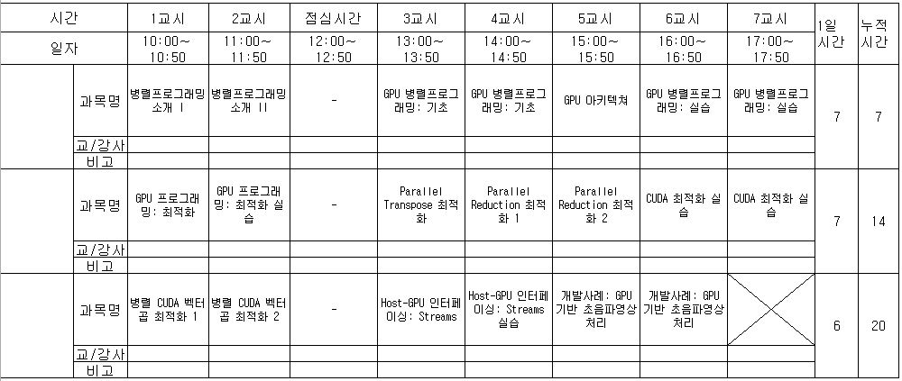

## 한국로봇산업진흥원 (https://www.kiria.org/)
# GPU를 이용한 병렬 프로그래밍 (CUDA 병렬 프로그래밍)
## High Performance Parallel Programming with Nvidia GPU

## 7월 3일 - 5일 (2박 3일)
### 강사: 이정근, 한림대학교 소프트웨어융합대학 교수
### Web: www.onchip.net

## Schedule (스케쥴)
  - **Day 1: 7월 3일**
    -	병렬프로그래밍소개
       - pthread / openmp / avx 등 맛보기 (01_cuda_lab)
    -	GPU 병렬프로그래밍 기초
    -	GPU 아키텍쳐
    - GPU 병렬프로그래밍: 실습
      - colab.research.goole.com에서 GPU 활용하기 ([hello_CUDA.ipynb](./hello_CUDA.ipynb))
      - [Google Drive와 연동하기](https://github.com/jeonggunlee/CUDATeaching/blob/master/colab_gdrive.ipynb)
    
  - **Day 2: 7월 4일**
    -	GPU 프로그래밍: 최적화
    -	GPU 프로그래밍: 최적화 실습
    -	Parallel Transpose 최적화
    -	Parallel Reduction 최적화
    -	CUDA 최적화 실습
    
  - **Day 3: 7월 5일**
    -	병렬 CUDA 벡터곱 최적화 (2시간)
    -	Host-GPU 인터페이싱: Streams
    -	Host-GPU 인터페이싱: Streams 실습
    -	개발사례: GPU 기반 초음파영상처리

*  *  *

*  *  *

## REFERENCES (참조Sites)
  - CUDA Sample Directory: C:\ProgramData\NVIDIA Corporation\CUDA Samples
  - CUDA 최고의강좌! 강추! Udacity [Intro to Parallel Programming](https://www.youtube.com/watch?v=F620ommtjqk&list=PLAwxTw4SYaPnFKojVQrmyOGFCqHTxfdv2)
  - Udacity [High Performance Computer Architecture](https://www.youtube.com/watch?v=tawb_aeYQ2g&list=PLAwxTw4SYaPmqpjgrmf4-DGlaeV0om4iP&index=1)
  - Udacity [High Performance Computing](https://www.youtube.com/watch?v=grD5en6_IiQ&list=PLAwxTw4SYaPk8NaXIiFQXWK6VPnrtMRXC)
  - [CUDA LECTURE](https://www.youtube.com/watch?v=sxhvmTveO2A) - Oklahoma State University
  - 코딩 실습을 위한 [클라우드 설정(AWS)](https://github.com/jeonggunlee/CUDATeaching/blob/master/gpu4cloud.md) 
